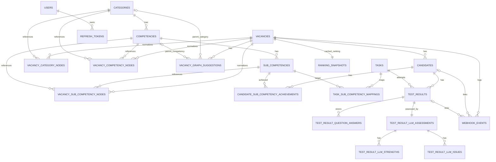

# DATABASE MODELS

Документ описывает актуальные модели БД backend-сервиса: для чего нужна каждая таблица и как таблицы связаны между собой.

Источник истины:
- ORM: `src/competency_system/infrastructure/persistence/models.py`
- Миграции: `alembic/versions/0001` ... `0005`

## 1. Картина по доменам

- Онтология компетенций: `categories`, `competencies`, `sub_competencies`
- Вакансия и нормализованный граф требований: `vacancies`, `vacancy_category_nodes`, `vacancy_competency_nodes`, `vacancy_sub_competency_nodes`, `vacancy_graph_suggestions`
- Кандидаты и результаты оценки: `candidates`, `candidate_sub_competency_achievements`, `tasks`, `task_sub_competency_mappings`, `test_results`, `test_result_question_answers`, `test_result_llm_assessments`, `test_result_llm_strengths`, `test_result_llm_issues`
- Авторизация: `users`, `refresh_tokens`
- Надежность интеграции и кэширование ранжирования: `webhook_events`, `ranking_snapshots`

## 2. Сущности и назначение

### 2.1 Онтология компетенций

| Таблица | Назначение | Ключевые поля | Связи |
|---|---|---|---|
| `categories` | Верхний уровень справочника компетенций | `id`, `name`, `description`, `emoji` | 1:N с `competencies` |
| `competencies` | Компетенции внутри категории | `id`, `category_id`, `name`, `description` | N:1 к `categories`, 1:N с `sub_competencies` |
| `sub_competencies` | Детализация компетенций до измеримого уровня | `id`, `competency_id`, `name`, `description` | N:1 к `competencies`; используется в маппингах задач и достижениях кандидата |

### 2.2 Вакансия и граф требований

| Таблица | Назначение | Ключевые поля | Связи |
|---|---|---|---|
| `vacancies` | Карточка вакансии и статус обработки | `id`, `name`, `description`, `status`, `error_message` | 1:N к кандидатам, узлам графа, предложениям и webhook-событиям; 1:1 с `ranking_snapshots` |
| `vacancy_category_nodes` | Нормализованный список категорий вакансии с порядком | `vacancy_id`, `category_id`, `position` | N:1 к `vacancies`, N:1 к `categories`; UK: (`vacancy_id`,`position`), (`vacancy_id`,`category_id`) |
| `vacancy_competency_nodes` | Нормализованный список компетенций вакансии | `vacancy_id`, `competency_id`, `category_id`, `is_required`, `position` | N:1 к `vacancies`, `competencies`, `categories`; UK: (`vacancy_id`,`position`), (`vacancy_id`,`competency_id`) |
| `vacancy_sub_competency_nodes` | Нормализованный список подкомпетенций вакансии с целевым уровнем и весом | `vacancy_id`, `sub_competency_id`, `competency_id`, `target_level`, `weight`, `position` | N:1 к `vacancies`, `sub_competencies`, `competencies`; UK: (`vacancy_id`,`position`), (`vacancy_id`,`sub_competency_id`) |
| `vacancy_graph_suggestions` | Предложения LLM/эксперта по изменению графа вакансии | `vacancy_id`, `stage`, `entity_type`, `status`, `name`, `reason`, `parent_category_id`, `parent_competency_id` | N:1 к `vacancies`; опциональные ссылки на `categories`/`competencies` |

### 2.3 Кандидаты, задания, оценка

| Таблица | Назначение | Ключевые поля | Связи |
|---|---|---|---|
| `candidates` | Кандидат в рамках конкретной вакансии | `id`, `external_id`, `vacancy_id`, `status`, `last_assessment_at` | N:1 к `vacancies`, 1:N к `test_results`, 1:N к `candidate_sub_competency_achievements` |
| `candidate_sub_competency_achievements` | Фактически подтвержденные подкомпетенции кандидата | `candidate_id`, `sub_competency_id`, `achieved_at` | N:1 к `candidates`, N:1 к `sub_competencies`; UK: (`candidate_id`,`sub_competency_id`) |
| `tasks` | Задания из внешней тестовой системы | `id`, `external_id`, `title`, `type`, `mapping_status`, `mapping_validated` | 1:N к `task_sub_competency_mappings`, 1:N к `test_results` |
| `task_sub_competency_mappings` | Привязка задания к подкомпетенциям с весами и порядком | `task_id`, `sub_competency_id`, `weight`, `position` | N:1 к `tasks`, N:1 к `sub_competencies`; UK: (`task_id`,`position`), (`task_id`,`sub_competency_id`) |
| `test_results` | Результат прохождения задания кандидатом | `candidate_id`, `task_id`, `passed`, `score`, `attempts`, `code_submitted` | N:1 к `candidates`, N:1 к `tasks`; 1:N к `test_result_question_answers`; 1:1 к `test_result_llm_assessments` |
| `test_result_question_answers` | Ответы на вопросы теста в рамках попытки | `test_result_id`, `question`, `answer`, `position` | N:1 к `test_results`; UK: (`test_result_id`,`position`) |
| `test_result_llm_assessments` | Итоговая LLM-оценка результата с метриками и фидбеком | `test_result_id`, `passed`, `score`, `feedback`, `criteria_version`, `final_score` | 1:1 к `test_results` (`test_result_id` unique), 1:N к strengths/issues |
| `test_result_llm_strengths` | Сильные стороны из LLM-оценки | `assessment_id`, `value`, `position` | N:1 к `test_result_llm_assessments`; UK: (`assessment_id`,`position`) |
| `test_result_llm_issues` | Замечания/проблемы из LLM-оценки | `assessment_id`, `value`, `position` | N:1 к `test_result_llm_assessments`; UK: (`assessment_id`,`position`) |

### 2.4 Авторизация

| Таблица | Назначение | Ключевые поля | Связи |
|---|---|---|---|
| `users` | Пользователи системы и их роль | `id`, `email`, `hashed_password`, `role`, `is_active` | 1:N к `refresh_tokens`; `email` unique |
| `refresh_tokens` | Хранимые refresh-токены для ротации и отзыва | `jti`, `user_id`, `token_hash`, `expires_at`, `revoked_at` | N:1 к `users`; `token_hash` unique |

### 2.5 Интеграция и кэширование

| Таблица | Назначение | Ключевые поля | Связи |
|---|---|---|---|
| `webhook_events` | Идемпотентная обработка входящих webhook-событий тестовой системы | `event_id`, `vacancy_id`, `candidate_external_id`, `task_external_id`, `status`, `payload`, `candidate_id`, `test_result_id` | N:1 к `vacancies`; опциональные N:1 к `candidates` и `test_results`; `event_id` unique |
| `ranking_snapshots` | Кэш последнего рассчитанного рейтинга по вакансии | `vacancy_id`, `payload`, `calculated_at` | 1:1 к `vacancies` (`vacancy_id` unique) |

## 3. Enum-статусы и их смысл

- `vacancy_status`: `draft`, `extracting`, `ready`, `failed`
- `assessment_status`: `pending`, `processing`, `completed`, `failed`
- `task_type`: `code`, `test`
- `task_mapping_status`: `pending`, `completed`, `failed`
- `suggestion_stage`: `category`, `competency`, `sub_competency`
- `suggestion_entity_type`: `category`, `competency`, `sub_competency`
- `suggestion_status`: `pending`, `approved`, `rejected`
- `user_role`: `admin`, `expert`, `hr`, `system`
- `webhook_event_status`: `processing`, `processed`, `failed`

## 4. Правила связности и удаления

- Основной паттерн для зависимых данных: `ON DELETE CASCADE`
- Для ссылок, которые должны переживать удаление связанной записи, используется `ON DELETE SET NULL`:
  - `vacancy_graph_suggestions.parent_category_id`
  - `vacancy_graph_suggestions.parent_competency_id`
  - `webhook_events.candidate_id`
  - `webhook_events.test_result_id`

Это обеспечивает:
- автоматическую очистку дочерних данных при удалении вакансий/кандидатов/задач;
- сохранение исторических записей предложений и webhook-событий даже при исчезновении части ссылок.

## 5. Mermaid ERD

## 6. Важные архитектурные особенности

- В схеме есть два уровня представления компетенций:
  - канонический справочник (`categories` / `competencies` / `sub_competencies`);
  - нормализованный граф конкретной вакансии (`vacancy_*_nodes`) с порядком и параметрами (`is_required`, `target_level`, `weight`).
- `vacancy_graph_suggestions` хранит предложения по изменению графа и их жизненный цикл, а не сам финальный граф.
- `webhook_events` решает идемпотентность и трассировку интеграции с внешней тестовой системой.
- `ranking_snapshots` хранит последний рассчитанный JSON-рейтинг по вакансии для быстрого чтения без пересчета.
