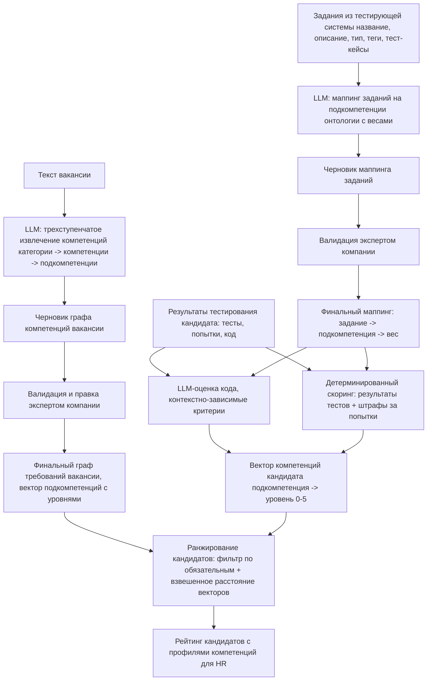

# ML System Design Doc: Система автоматизированного скоринга IT-компетенций
## 1. Цели и предпосылки

### 1.1. Зачем идем в разработку продукта?

**Бизнес-цель:**
Сократить расходы на подбор персонала и время закрытия вакансий за счет автоматического ранжирования кандидатов по соответствию их навыков конкретной вакансии на основе объективных результатов тестирования.

**Целевой эффект:**
Переход от оценки текста резюме и суммарного балла за тестирование к оценке профиля компетенций кандидата в разрезе требований конкретной вакансии. Снижение риска ошибок в найме и стоимости проведения интервью экспертами.

**Почему станет лучше, чем сейчас, от использования ML:**

**Текущее состояние:**

Технические требования к вакансиям формулируются HR нечетко, что приводит к размытым и несопоставимым описаниям навыков. Существующие системы тестирования выдают суммарный балл за тестирование, который не учитывает структуру компетенций вакансии. Кандидат с более высоким баллом может уступать кандидату с меньшим баллом по тем компетенциям, которые реально нужны компании. Технический эксперт тратит время на интервью, часть из которых завершается досрочно из-за несоответствия кандидата базовым hard-skills требованиям.

**С использованием ML:**

1. Вместо полного ручного составления списка компетенций экспертом — автоматическая декомпозиция вакансии на атомарные навыки, которая занимает менее минуты, плюс последующая валидация экспертом.
2. Автоматический маппинг заданий тестирующей системы на граф компетенций позволяет понять, какие навыки проверяет каждое задание.
3. Ранжирование кандидатов происходит автоматически на основе объективных результатов технического тестирования.
4. HR отбирает топ-N кандидатов с наиболее высоким скором соответствия навыков, что сокращает долю проведенных зря интервью.

**Что будем считать успехом итерации (бизнес-метрики):**

1. Доля кандидатов из топ-N рейтинга системы для конкретной вакансии, успешно прошедших первое техническое интервью, составляет не менее 70%.
2. Эксперт при валидации графа компетенций вносит не более 10-15% правок от общего числа извлеченных компетенций - то есть вариант графа, составленный LLM, пригоден к использованию без существенных изменений.
3. Подготовка профиля вакансии с правками эксперта занимает не более 15 минут, что существенно меньше по сравнению с полностью ручным составлением.
4. Доля заданий тестирующей системы, получивших корректный маппинг на компетенции по оценке эксперта компании, составляет не менее 80%.
5. Корреляция скора системы с результатами технического интервью положительная и значимая (проверяется по итогам пилота).

### 1.2. Бизнес-требования и ограничения

**Бизнес-требования:**

- Система принимает на вход неструктурированный текст вакансии и выдает структурированный иерархический граф hard-skills: категория -> компетенция -> подкомпетенция.
- Интерфейс для эксперта компании: возможность отредактировать предложенный системой перечень компетенций, принять или отклонить предложения LLM о новых сущностях.
- Автоматический маппинг заданий тестирующей системы на компетенции из онтологии с весами; результат валидируется экспертом компании.
- Интеграция с внешней тестирующей системой: получение заданий, результатов тестирования, кода кандидатов, истории попыток.
- Выдача HR-менеджеру финального рейтинга кандидатов с прозрачной системой оценивания на основе скора по компетенциям, с возможностью просмотра профиля компетенций каждого кандидата.

**Бизнес-ограничения:**

- В MVP система ориентирована на ограниченный набор ролей (Data Scientist / Backend) и не претендует на универсальное покрытие всех IT-профилей без дополнительной настройки онтологии.
- Фокус только на hard skills. Soft skills, локация и зарплатные ожидания в данной итерации не учитываются.
- Входом для оценки служат только верифицированные артефакты из внешней тестирующей системы: код, результаты тестов, выполненные задания, история попыток и связанные метаданные. Система не работает с резюме.
- Конфиденциальность: персональные данные кандидатов в систему не передаются. Оперируем только анонимным ID и артефактами тестирования.
- Система не разрабатывает собственный модуль прокторинга и защиты от списывания - это зона ответственности внешней тестирующей системы.

**Что мы ожидаем от конкретной итерации:**

Пилотный запуск на двух типах вакансий (Backend, Data Scientist). Результатом является отсортированный список кандидатов на каждую вакансию с профилями компетенций, переданный HR-менеджеру.

### 1.3. Что входит в скоуп проекта/итерации, что не входит

**Входит:**

- Модуль извлечения компетенций из текста вакансии.
- Интеграция с одной внешней тестирующей системой: получение заданий, результатов тестирования, кода кандидатов.
- Модуль маппинга заданий тестирующей системы на компетенции из онтологии с весами (LLM + валидация экспертом компании).
- Модуль оценки кода кандидата с контекстно-зависимыми критериями.
- Интерфейс правки графа компетенций и маппинга экспертом, включая возможность принять или отклонить предложения LLM о новых компетенциях.
- Пайплайн оценки кандидата: формирование вектора компетенций на основе маппинга, результатов тестов, оценки кода и штрафов за попытки.
- Двухступенчатая модель ранжирования:
    1. Фильтр по обязательным компетенциям.
    2. Ранжирование по близости векторов компетенций кандидата и требований вакансии.
- Интерфейс просмотра профиля компетенций каждого кандидата из рейтинга.

**Не входит:**

- Разработка собственной тестирующей системы или модуля прокторинга.
- Интеграция с другими тестирующими системами, кроме одной пилотной.
- Оценка soft skills.
- Автоматическое обновление справочника компетенций в БД - только ручное добавление экспертом через интерфейс.
- Работа с резюме в любом виде.

**Технический долг:**

- LLM и промпты подбираются в процессе путем сравнения результатов на пилотном наборе вакансий и заданий.
- В MVP используем внешнего LLM-провайдера; в перспективе - self-hosted провайдер.
- Оптимизация промптов и батчевая обработка для ускорения пайплайна.
- Веса и коэффициенты для скоринга (штрафы за попытки, веса результатов тестов) подбираются вручную на этапе пилота.
- Критерии LLM-оценки кода по типам задач формализуются и расширяются итеративно.

### 1.4. Предпосылки решения

- Суммарный балл тестирования не отражает соответствие кандидата конкретной вакансии. Ранжирование по профилю компетенций под требования вакансии объективнее, чем сортировка по итоговому скору.
- LLM используется для трех задач: декомпозиция вакансии, маппинг заданий на онтологию, оценка кода. Финальные результаты первых двух всегда подтверждаются экспертом компании.
- Фиксированная онтология компетенций в БД: категории, компетенции, подкомпетенции. Извлеченные навыки сопоставляются с ней, новые сущности добавляются только после согласования с экспертом.
- Гранулярность модели вакансии - иерархический граф: категория -> компетенция -> подкомпетенция. Уровень владения компетенцией (0-5) определяется набором освоенных подкомпетенций и их весами.
- Оценка кода контекстно-зависима: для алгоритмической задачи оцениваются корректность алгоритма и используемые конструкции, для продуктовой задачи - дополнительно стиль и именование.
- Ранжирование кандидатов обновляется при поступлении новых данных из тестирующей системы или изменении профиля вакансии.
- В MVP система работает только с hard skills и только для ролей Backend / Data Scientist.

## 2. Методология (DS)

### 2.1. Постановка задачи

Система решает четыре ML-подзадачи, объединенные в единый пайплайн. Детерминированный модуль скоринга (результаты тестов, штрафы за попытки) в рамках данного раздела ML-задачей не считается.

**Подзадача 1 - Извлечение компетенций из текста вакансии**

Вход: неструктурированный текст вакансии.  
Выход: иерархический граф компетенций (категория -> компетенция -> подкомпетенция), сопоставленный с онтологией из БД; опционально - предложения новых сущностей.  
Техника: трехступенчатый LLM-пайплайн с промптингом и JSON-выводом. На каждом шагу модель получает текст вакансии и список сущностей текущего уровня из БД, выбирает релевантные и при необходимости предлагает новые.

**Подзадача 2 - Извлечение тестируемых компетенций из заданий**

Вход: задания из тестирующей системы (название, описание, тип задачи, теги, тест-кейсы).  
Выход: для каждого задания - список подкомпетенций из онтологии с весом присутствия (0-1), отражающим степень раскрытия подкомпетенции в данном задании.  
Техника: двухэтапный пайплайн:
1. Поиск кандидатов-подкомпетенций: тот же трехступенчатый LLM-пайплайн применяется к описанию задания - модель определяет, какие подкомпетенции из онтологии проверяет данное задание.
2. LLM-валидация и определение весов: для каждой пары (задание, кандидат-подкомпетенция) модель оценивает релевантность и присваивает вес связи (0.0-1.0).

Результат валидируется экспертом компании; после валидации маппинг фиксируется и используется для скоринга.

**Подзадача 3 - LLM-оценка кода кандидата**

Вход: задание (описание, тип задачи), код кандидата, результаты прохождения тест-кейсов. Выход: оценки по релевантным критериям качества кода (0-1 по каждому критерию) с итоговым взвешенным скором. Техника: LLM-оценка с контекстно-зависимым промптом. Тип задачи определяет набор применяемых критериев:

- Алгоритмическая задача: корректность алгоритма, временная и пространственная сложность, используемые языковые конструкции.
- Продуктовая задача: дополнительно - стиль кода, именование, читаемость.

Промпт версионируется. Формат ответа - строгий JSON с оценками по критериям и кратким обоснованием.

**Подзадача 4 - Ранжирование кандидатов под вакансию**

Вход: вектор компетенций кандидата (подкомпетенция -> уровень владения 0-5, получен из скорингового модуля на основе результатов тестов, LLM-оценки кода и штрафов за попытки), вектор требований вакансии (подкомпетенция -> требуемый уровень, получен из подзадачи 1). Выход: отсортированный список кандидатов с итоговым скором соответствия и профилем компетенций каждого кандидата. Техника: двухступенчатая схема - (1) жесткий фильтр по обязательным компетенциям, (2) взвешенное косинусное расстояние между векторами кандидата и вакансии.

### 2.2. Блок-схема решения

Ниже представлена единая схема пайплайна от текста вакансии до рейтинга кандидатов. Бейзлайн и MVP различаются только внутри отдельных блоков (описано в 2.3); общая архитектура одинакова.

### 2.3. Этапы решения задачи

#### Этап 1 - Подготовка данных

Реальные данные из тестирующей системы доступны ограниченно на этапе MVP. Для разработки и валидации используется комбинация: синтетически сгенерированные примеры и небольшая выборка реальных данных.

| Название данных                                                       | Наличие                                              | Ресурс для получения | Качество проверено             |
| --------------------------------------------------------------------- | ---------------------------------------------------- | -------------------- | ------------------------------ |
| Тексты вакансий (Backend, DS)                                         | Синтетика + открытые источники                       | DS                   | Нет, формируется на этапе 1    |
| Онтология компетенций (категории, компетенции, подкомпетенции)        | Создается вручную экспертом в рамках проекта         | Эксперт + DS         | Нет, валидируется экспертом    |
| Задания тестирующей системы (описания, типы, теги, тест-кейсы)        | Частично доступны; синтетика как дополнение          | DS + интеграция      | Нет, проверяется при получении |
| Результаты тестирования кандидатов (тесты, попытки, код)              | Частично доступны; синтетика для покрытия edge cases | DS + интеграция      | Нет, проверяется при получении |
| Экспертная разметка маппингов (задание -> подкомпетенция)             | Создается в рамках проекта                           | Эксперт компании     | Нет, является ground truth     |
| Экспертная разметка графов компетенций вакансий                       | Создается в рамках проекта                           | Эксперт              | Нет, является ground truth     |
| Размеченные примеры оценки кода (код + эталонные оценки по критериям) | Создается в рамках проекта                           | Эксперт + DS         | Нет, является ground truth     |

**Выход этапа:**
- Онтология компетенций в БД (минимум: покрытие ролей Backend и Data Scientist).
- Размеченный набор из не менее 10 вакансий с валидированными графами компетенций (ground truth для подзадачи 1).
- Размеченный набор из не менее 20-30 заданий с валидированными маппингами (ground truth для подзадачи 2).
- Размеченный набор решений кода с эталонными оценками по критериям (ground truth для подзадачи 3).
- Синтетические профили кандидатов для проверки ранжирования.

#### Этап 2 - Бейзлайн

**Бейзлайн для подзадачи 1 (извлечение компетенций):** Одношаговый промпт без опоры на онтологию из БД - LLM извлекает компетенции напрямую из текста вакансии в свободном формате. Результат сравнивается с экспертной разметкой.

**Бейзлайн для подзадачи 2 (маппинг заданий):** Маппинг только по тегам задания: прямое текстовое совпадение тега с названием подкомпетенции или ее синонимом из онтологии. Вес присутствия бинарный (0 или 1).

**Бейзлайн для подзадачи 3 (оценка кода):** Оценка только по результатам прохождения тест-кейсов: доля пройденных тестов как единственный сигнал качества решения.

**Бейзлайн для подзадачи 4 (ранжирование):** Сортировка кандидатов по суммарному баллу тестирования без учета структуры компетенций вакансии.

**Метрики бейзлайна:**

| Подзадача              | Метрика                                                                   | Целевой порог бейзлайна       |
| ---------------------- | ------------------------------------------------------------------------- | ----------------------------- |
| Извлечение компетенций | Согласование с экспертом: доля подкомпетенций, принятых без правок        | Фиксируем как отправную точку |
| Маппинг заданий        | Согласование с экспертом: доля заданий с корректным маппингом             | Фиксируем как отправную точку |
| Оценка кода            | Согласование с эталонной разметкой: корреляция скора с экспертной оценкой | Фиксируем как отправную точку |
| Ранжирование           | Spearman correlation с экспертной расстановкой на синтетике               | Фиксируем как отправную точку |

Цель бейзлайна - зафиксировать нижнюю границу качества, относительно которой оценивается улучшение MVP.

#### Этап 3 - MVP

**MVP подзадача 1 (извлечение компетенций):** 
Трехступенчатый LLM-пайплайн с опорой на онтологию: на каждом шагу модель получает текст вакансии и список сущностей текущего уровня из БД, выбирает релевантные, оценивает обязательность и при необходимости предлагает новые сущности с обоснованием. Промпт версионируется. Формат ответа - строгий JSON, валидируется по схеме.

Выборка для оценки: размеченный набор вакансий из этапа 1. Схема валидации: LLM-черновик сравнивается с экспертной разметкой до и после правки экспертом.

**MVP подзадача 2 (маппинг заданий):**
Двухэтапный пайплайн:
1. Поиск кандидатов-подкомпетенций: трехступенчатый LLM-пайплайн применяется к описанию задания - на каждом шагу модель получает описание задания и список сущностей текущего уровня из онтологии.
2. LLM-валидация и определение весов: для каждой пары (задание, кандидат-подкомпетенция) модель оценивает релевантность и присваивает вес (0.0-1.0).

Результат валидируется экспертом компании и фиксируется в БД.

**MVP подзадача 3 (оценка кода):** LLM-оценка с контекстно-зависимым промптом. Тип задачи (алгоритмическая / продуктовая) определяется автоматически на основе описания и тегов задания, либо задается явно при маппинге. Набор критериев оценки определяется типом задачи. Промпт передает модели: описание задачи, тип, код кандидата, результаты тест-кейсов. Ответ - JSON с оценками по критериям (0-1) и кратким обоснованием для каждого. Итоговый скор оценки кода - взвешенная сумма оценок по критериям.

**MVP подзадача 4 (ранжирование):**
Двухступенчатая схема:
1. Жесткий фильтр: кандидаты, не покрывающие обязательные подкомпетенции вакансии выше порогового уровня, исключаются из рейтинга.
2. Взвешенное косинусное расстояние между вектором кандидата и вектором требований вакансии. Веса подкомпетенций определяются их важностью в графе вакансии (must have получают больший вес).

**Метрики MVP:**

| Подзадача              | Метрика                                                     | Целевой порог MVP      |
| ---------------------- | ----------------------------------------------------------- | ---------------------- |
| Извлечение компетенций | Доля подкомпетенций, принятых экспертом без правок          | ≥ 70%                  |
| Маппинг заданий        | Доля заданий с корректным маппингом по оценке эксперта      | ≥ 80%                  |
| Оценка кода            | Корреляция LLM-скора с эталонной экспертной оценкой         | Значимо выше бейзлайна |
| Ранжирование (офлайн)  | Spearman correlation с экспертной расстановкой на синтетике | Значимо выше бейзлайна |
| Ранжирование (пилот)   | Доля кандидатов из топ-N, прошедших техническое интервью    | ≥ 70%                  |

**Риски и план:**

| Риск                                                                               | Что делаем                                                                                                              |
| ---------------------------------------------------------------------------------- | ----------------------------------------------------------------------------------------------------------------------- |
| LLM предлагает нерелевантные компетенции, перегружая эксперта правками             | Ограничиваем число предложенных сущностей за один запрос; настраиваем порог уверенности через few-shot примеры          |
| Задания слабо описаны (короткое название без описания и тегов) - маппинг ненадежен | Для заданий без достаточного контекста маппинг помечается как требующий ручной проверки экспертом                       |
| Онтология не покрывает реальные требования вакансий пилота                         | Предусмотрен механизм предложения новых сущностей LLM + быстрое добавление экспертом до начала пилота                   |
| LLM-оценка кода нестабильна на одном и том же решении                              | Фиксируем temperature=0; добавляем few-shot примеры с эталонными оценками; проверяем стабильность на повторных прогонах |
| Отсутствие реальных данных о результатах интервью для валидации ранжирования       | На этапе MVP валидируем офлайн на синтетике; корреляцию с интервью проверяем только в пилоте                            |

**Бизнес-проверка результатов:** По завершении этапа эксперт проводит приемку на пилотном наборе: 10 вакансий и 30-40 заданий. Фиксируется доля принятых без правок сущностей и субъективная оценка полноты покрытия требований вакансии.

## 3. Подготовка пилота

### 3.1. Способ оценки пилота

Пилот проводится на двух типах вакансий (Backend, Data Scientist) с техническими экспертами в роли валидаторов. Полноценный A/B тест на данном этапе невозможен: нет исторических данных о найме и достаточного потока кандидатов. Поэтому пилот строится как экспертная офлайн-оценка с элементами проверки на реальных кандидатах.

**Дизайн пилота состоит из двух частей:**

**Часть 1 - офлайн-оценка качества ML-модулей (до реального использования):**

- Эксперт валидирует графы компетенций, сформированные системой по 20 реальным вакансиям, и маппинги по 30-50 заданиям.
- Фиксируется доля принятых без правок сущностей и время, затраченное экспертом на валидацию одной вакансии.
- LLM-оценки кода сравниваются с эталонной экспертной разметкой на наборе решений из этапа 1.
- Система ранжирует синтетических кандидатов с известными профилями компетенций; результат сравнивается с экспертной расстановкой (Spearman correlation).

**Часть 2 - проверка ранжирования на реальных кандидатах (при наличии):**

- HR получает топ-N кандидатов по двум пилотным вакансиям без суммарного балла тестирования - только профиль компетенций и скор соответствия.
- После проведения технических интервью фиксируется, сколько кандидатов из топ-N прошли первое интервью успешно.
- Результаты используются для оценки бизнес-метрики и калибровки весов скорингового модуля.

### 3.2. Что считаем успешным пилотом

**Метрики качества ML-модулей:**

| Метрика                                                     | Способ измерения                               | Порог успеха                      |
| ----------------------------------------------------------- | ---------------------------------------------- | --------------------------------- |
| Доля подкомпетенций вакансии, принятых экспертом без правок | Экспертная валидация на 20 вакансиях           | ≥ 70%                             |
| Доля заданий с корректным маппингом                         | Экспертная валидация на 30-50 заданиях         | ≥ 80%                             |
| Корреляция LLM-оценки кода с эталонной разметкой            | Сравнение с ground truth из этапа 1            | Значимо выше бейзлайна (p < 0.05) |
| Время валидации одной вакансии экспертом                    | Хронометраж сессии валидации                   | ≤ 15 минут                        |
| Spearman correlation ранжирования с экспертной расстановкой | Синтетические кандидаты с известными профилями | Значимо выше бейзлайна (p < 0.05) |

**Бизнес-метрика:**

| Метрика                                                                 | Способ измерения                              | Порог успеха |
| ----------------------------------------------------------------------- | --------------------------------------------- | ------------ |
| Доля кандидатов из топ-N, успешно прошедших первое техническое интервью | Обратная связь от HR/технического интервьюера | ≥ 70%        |

Если метрики ML-модулей не достигнуты - пилот считается провальным и не переходит к следующей части. Если проверка на реальных кандидатах недостижима в рамках итерации (нет реального потока), она переносится на следующий этап; пилот считается частично успешным при выполнении офлайн-метрик.

### 3.3. Подготовка пилота

**Вычислительная сложность:**

Основная вычислительная нагрузка пилота - вызовы внешнего LLM-провайдера. Классическое ML-обучение в пайплайне отсутствует, инфраструктурных GPU-затрат нет. Онтология: ~15-20 категорий, ~20-30 компетенций на категорию, ~20-40 подкомпетенций на компетенцию; каждая сущность - название + описание (~20 токенов).

**Подзадача 1 - извлечение компетенций из одной вакансии:**

Трехступенчатый пайплайн разворачивается в дерево запросов. Например: выбрано 4 категории, из каждой - 3 компетенции (12 итого), из каждой - 3 подкомпетенции (36 итого).

- Шаг 1 (категории): 1 запрос. Текст вакансии (~500 т.) + 15-20 категорий с описаниями (~400 т.) ≈ **900 токенов input**.
- Шаг 2 (компетенции): 4 запроса, по 1 на выбранную категорию. Текст вакансии + 20-30 компетенций (~750 т.) ≈ **1 250 токенов input** на запрос.
- Шаг 3 (подкомпетенции): 12 запросов, по 1 на выбранную компетенцию. Текст вакансии + 20-40 подкомпетенций (~800 т.) ≈ **1 300 токенов input** на запрос.

Итого на 1 вакансию: **17 запросов**, ~17 500 токенов input, ~1 500 токенов output. На 20 вакансий пилота: **~340 запросов**, ~350 000 input + ~30 000 output токенов.

**Подзадача 2 - маппинг заданий (~40 заданий пилота):**

На каждое задание:

- Поиск кандидатов-подкомпетенций: тот же трехступенчатый пайплайн (~17 запросов, ~17 500 токенов input).
- Финальная валидация и расстановка весов: 1 запрос. Описание задания + список кандидатов ≈ **800 токенов input**, ~150 output.

Итого на 1 задание: **18 запросов**, ~18 300 токенов input. На 40 заданий пилота: **~720 запросов**, ~732 000 input + ~6 000 output токенов.

**Подзадача 3 - LLM-оценка кода (~200 решений пилота):**

1 запрос на решение. Описание задачи + код кандидата (~800 т.) + системный промпт с критериями (~300 т.) ≈ **1 100 токенов input**, ~200 output.

На 200 решений пилота: **200 запросов**, ~220 000 input + ~40 000 output токенов.

**Итоговая оценка затрат на пилот (модель gpt-oss-20b: \$0.03/M input, \$0.14/M output):**

|                           | Количество запросов | Input токены | Output токены | Стоимость  |
| ------------------------- | ------------------- | ------------ | ------------- | ---------- |
| Подзадача 1 (20 вакансий) | ~340                | ~350K        | ~30K          | ~$0.015    |
| Подзадача 2 (40 заданий)  | ~720                | ~732K        | ~6K           | ~$0.023    |
| Подзадача 3 (200 решений) | ~200                | ~220K        | ~40K          | ~$0.012    |
| **Итого**                 | **~1 260**          | **~1.3M**    | **~76K**      | **~$0.05** |

Денежные затраты незначительны. Число запросов умеренное, rate limits провайдера при последовательной обработке не критичны. Батчевая обработка реализуется с очередью и retry-логикой; точное число токенов на запрос уточняется на бейзлайн-эксперименте по реальным логам.

**Что фиксируем до запуска пилота:**

- Версии промптов для всех шагов подзадач 1, 2 и 3.
- Используемую модель LLM и провайдера (фиксируется для воспроизводимости).
- Онтологию компетенций в БД (версия, зафиксированная экспертом).
- Состав пилотного набора: список вакансий, список заданий, набор решений для оценки кода, синтетические профили кандидатов.
- Параметры детерминированного скорингового модуля: веса результатов тестов, штрафы за попытки.
- Порог жесткого фильтра ранжирования по обязательным компетенциям.

**План запуска:**

1. Технический прогон на 2-3 вакансиях и 5 заданиях - проверка корректности пайплайна, формата вывода, схем JSON.
2. Офлайн-оценка на полном пилотном наборе - экспертная валидация, замер метрик ML-модулей.
3. Анализ ошибок: разбор типовых FP/FN в маппингах и графах компетенций, нестабильных оценок кода; корректировка промптов при необходимости.
4. Проверка на реальных кандидатах (при наличии): передача топ-N HR, сбор обратной связи по результатам интервью.
5. Финальный отчет: метрики по каждому модулю, вывод о готовности к расширению на большее число вакансий и заданий.
