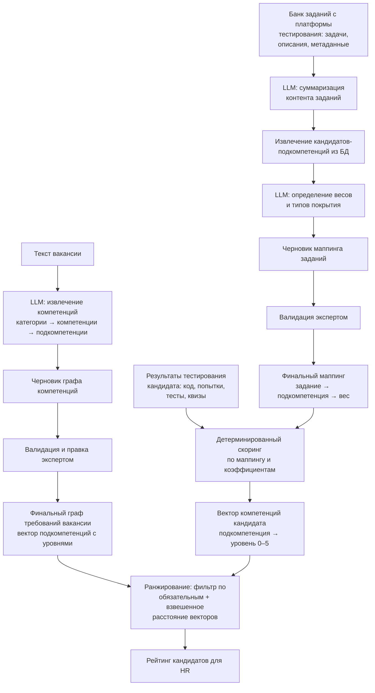

# ML System Design Doc: Система автоматизированного скоринга IT-компетенций AI competency profiler
## 1. Цели и предпосылки

### 1.1. Зачем идем в разработку продукта?

**Бизнес-цель:**
Сократить расходы на подбор персонала и время закрытия вакансий за счет исключения этапа ручного скрининга резюме и отсева нерелевантных кандидатов.

**Целевой эффект:**
Переход от оценки текста резюме к оценке реальных навыков, снижение риска ошибок в найме и стоимости проведения интервью экспертами.

**Почему станет лучше, чем сейчас, от использования ML:**

**Текущее состояние:**

Технические требования к вакансиям формулируются HR нечетко, что приводит к размытым и несопоставимым описаниям навыков. Кандидаты не получают чёткого сигнала о том, что именно требуется, а нанимающая сторона не может объективно сравнить кандидатов между собой. Технический эксперт тратит время на интервью, часть из которых завершается досрочно из-за несоответствия кандидата базовым hard-skills требованиям.

**С использованием ML:**

1. Вместо полного ручного составления списка компетенций экспертом — автоматическая декомпозиция вакансии на атомарные навыки, которая занимает менее минуты, плюс последующая валидация экспертом.
2. Ранжирование кандидатов происходит автоматически на основе объективных результатов технического тестирования.
3. HR отбирает топ-N кандидатов с наиболее высоким скором соответствия навыков, что сокращает долю проведенных зря интервью.

**Что будем считать успехом итерации (бизнес-метрики):**

1. Доля кандидатов из топ-N рейтинга системы для конкретной вакансии, успешно прошедших первое техническое интервью, составляет не менее 70%.
2. Эксперт при валидации графа компетенций вносит не более 10–15% правок от общего числа извлечённых компетенций — то есть вариант графа LLM пригоден к использованию без существенной переработки.
3. Подготовка профиля вакансии с правками эксперта занимает не более 15 минут, что существенно меньше времени по сравнению с полностью ручным составлением.
4. Сопоставление заданий из банка тестирования с компетенциями: доля заданий, получивших корректный маппинг по оценке эксперта, составляет не менее 80%.
5. Корреляция скора системы с результатами технического интервью положительная и значимая (проверяется по итогам пилота).

### 1.2. Бизнес-требования и ограничения

**Бизнес-требования:**

- Система принимает на вход неструктурированный текст вакансии и выдает структурированный иерархический граф hard-skills: категория → компетенция → подкомпетенция.
- Интерфейс для эксперта: возможность отредактировать предложенный системой перечень компетенций, принять или отклонить предложения LLM о новых сущностях.
- Интеграция с внешней платформой тестирования: получение банка заданий (задачи с описаниями, тест-кейсами, метаданными) и результатов прохождения кандидатами (код, результаты тестов, история попыток, квизы).
- Суммаризация контента заданий через LLM для подготовки данных к маппингу на компетенции.
- Извлечение кандидатов-подкомпетенций из суммаризированного контента заданий (отдельный модуль) с последующим определением весов связей через LLM.
- Автоматический маппинг заданий из банка тестирования на компетенции из онтологии с весами; результат валидируется экспертом.
- Выдача HR-менеджеру финального рейтинга кандидатов с прозрачной системой оценивания на основе скора по компетенциям.

**Бизнес-ограничения:**

- В MVP система ориентирована на ограниченный набор ролей (Data Scientist / Backend) и не претендует на универсальное покрытие всех IT-профилей без дополнительной настройки онтологии.
- Фокус только на hard skills. Soft skills, локация и зарплатные ожидания в данной итерации не учитываются.
- Входом для оценки служат только проверяемые артефакты с платформы тестирования: код, результаты тестов, выполненные задания, история попыток и связанные метаданные.
- Конфиденциальность: персональные данные кандидатов в систему не передаются. Оперируем только анонимным ID и артефактами тестирования (код, результаты тестов, попытки).

**Что мы ожидаем от конкретной итерации:**

Пилотный запуск на двух типах вакансий (Backend, Data Scientist). Результатом является отсортированный список кандидатов на каждую вакансию, переданный HR-менеджеру.

### 1.3. Что входит в скоуп проекта/итерации, что не входит

**Входит:**

- Модуль извлечения компетенций из текста вакансии.
- Интеграция с одной внешней платформой тестирования: получение банка заданий и результатов прохождения кандидатами.
- Модуль маппинга заданий из банка тестирования на компетенции из онтологии с весами (LLM + валидация экспертом).
- Интерфейс правки графа компетенций и маппинга экспертом, включая возможность принять или отклонить предложения LLM о новых компетенциях.
- Пайплайн оценки кандидата по результатам тестирования с использованием маппинга: формирование вектора компетенций и итогового скора.
- Двухступенчатая модель ранжирования:
  1. Фильтр по критичным (обязательным) компетенциям.
  2. Ранжирование по близости векторов компетенций кандидата и требований вакансии.

**Не входит:**

- Разработка собственной платформы тестирования (используем внешнюю систему).
- Интеграция с другими платформами тестирования, кроме одной пилотной.
- Оценка soft skills.
- Автоматическое обновление справочника компетенций в БД — только ручное добавление экспертом через интерфейс.
- Работа с резюме.

**Технический долг:**

- LLM и промпты подбираются в процессе путём сравнения результатов на пилотном наборе вакансий и заданий.
- В MVP используем внешнего LLM-провайдера; в перспективе — self-hosted провайдер.
- Оптимизация промптов и батчевая обработка для ускорения пайплайна.
- Веса и коэффициенты для скоринга артефактов (число попыток, качество кода, время и т.д.) подбираются вручную на этапе пилота.

### 1.4. Предпосылки решения

- Приоритет у объективных данных с платформы тестирования: код, результаты тестов, выполненные задания, число попыток и другие артефакты. Резюме не используются как шумный и недостоверный источник оценки hard skills.
- LLM используется только для подготовки черновиков (граф компетенций из вакансии, маппинг заданий). Финальная версия всегда подтверждается экспертом.
- Фиксированная онтология компетенций в БД: категории, компетенции, подкомпетенции. Извлечённые навыки сопоставляются с ней, новые сущности добавляются только после согласования с экспертом.
- Гранулярность модели вакансии — иерархический граф: категория → компетенция → подкомпетенция. Уровень владения компетенцией (0–5) определяется набором освоенных подкомпетенций и их весами.
- Архитектурное разделение пайплайна маппинга заданий: извлечение кандидатов-подкомпетенций (отдельный модуль) и определение весов связей + валидация (модуль маппинга). Суммаризация контента заданий через LLM предшествует обоим этапам.
- Ранжирование кандидатов обновляется при поступлении новых результатов тестирования или изменении профиля вакансии.
- В MVP система работает только с hard skills и только для ролей Backend / Data Scientist.

---

## 2. Методология (DS)

### 2.1. Постановка задачи

Система решает три ML-подзадачи, объединённые в единый пайплайн. Скоринг кандидата по артефактам тестирования является детерминированным модулем с вручную подобранными весами и в рамках данного раздела не рассматривается как ML-задача.

**Подзадача 1 — Извлечение компетенций из текста вакансии**

Вход: неструктурированный текст вакансии.
Выход: иерархический граф компетенций (категория → компетенция → подкомпетенция), сопоставленный с онтологией из БД; опционально — предложения новых сущностей.
Техника: трёхступенчатый LLM-пайплайн с промптингом и JSON-выводом. На каждом шаге модель получает текст вакансии и список сущностей текущего уровня из БД, выбирает релевантные и при необходимости предлагает новые.

**Подзадача 2 — Маппинг заданий на онтологию компетенций**

Вход: банк заданий с платформы тестирования (задачи с описаниями, тест-кейсами, метаданными; опционально — сопроводительные материалы: описания тем, пояснения).
Выход: для каждого задания — список подкомпетенций из онтологии с весом (0–1) и типом покрытия
(practices/evaluates).

Техника: трёхэтапный пайплайн:
1. LLM-суммаризация контента задания в краткое описание с сохранением ключевых тем и навыков.
2. Извлечение кандидатов-подкомпетенций из саммари (отдельный модуль — поиск по онтологии в БД).
3. LLM-валидация и определение весов: для каждой пары (задание, кандидат-подкомпетенция) модель определяет релевантность, вес связи и тип покрытия.

Результат валидируется экспертом; после валидации маппинг фиксируется и используется для скоринга.

**Подзадача 3 — Ранжирование кандидатов под вакансию**

Вход: вектор компетенций кандидата (подкомпетенция → уровень владения 0–5, получен из скорингового модуля), вектор требований вакансии (подкомпетенция → требуемый уровень, получен из подзадачи 1).
Выход: отсортированный список кандидатов с итоговым скором соответствия.
Техника: двухступенчатая схема — (1) жёсткий фильтр по обязательным компетенциям, (2) взвешенное косинусное расстояние между векторами кандидата и вакансии. В перспективе — обучаемая модель ранжирования при наличии разметки (результатов интервью).

### 2.2. Блок-схема решения

Ниже представлена единая схема пайплайна от текста вакансии до рейтинга кандидатов. Бейзлайн и MVP различаются только внутри отдельных блоков (описано в 2.3); общая архитектура одинакова.

### 2.3. Этапы решения задачи

#### Этап 1 — Подготовка данных

Реальные данные с платформы тестирования доступны ограниченно на этапе MVP. Для разработки и валидации используется комбинация: синтетически сгенерированные примеры и небольшая выборка реальных данных (при наличии доступа).

| Название данных | Наличие | Ресурс для получения | Качество проверено |
|---|---|---|---|
| Тексты вакансий (Backend, DS) | Синтетика + открытые источники (hh.ru) | DS | Нет, формируется на этапе 1 |
| Онтология компетенций (категории, компетенции, подкомпетенции) | Создаётся вручную экспертом в рамках проекта | Эксперт + DS | Нет, валидируется экспертом |
| Банк заданий с платформы тестирования (задачи, описания, метаданные) | Частично доступен от платформы-партнёра; синтетика как дополнение | DS + интеграция | Нет, проверяется при получении |
| Результаты тестирования кандидатов (код, попытки, тесты) | Частично доступен от платформы; синтетика для покрытия edge cases | DS + интеграция | Нет, проверяется при получении |
| Экспертная разметка маппингов (задание → подкомпетенция) | Создаётся в рамках проекта | Эксперт | Нет, является ground truth |
| Экспертная разметка графов компетенций вакансий | Создаётся в рамках проекта | Эксперт | Нет, является ground truth |

**Выход этапа:**
- Онтология компетенций в БД (минимум: покрытие ролей Backend и Data Scientist).
- Размеченный набор из не менее 20 вакансий с валидированными графами компетенций (ground truth для подзадачи 1).
- Размеченный набор из не менее 2–3 блоков заданий с валидированными маппингами (ground truth для подзадачи 2).
- Синтетические профили кандидатов для проверки ранжирования.

#### Этап 2 — Бейзлайн

**Бейзлайн для подзадачи 1 (извлечение компетенций):**
Одношаговый промпт без опоры на онтологию из БД — LLM извлекает компетенции напрямую из текста вакансии в свободном формате. Результат сравнивается с экспертной разметкой.

**Бейзлайн для подзадачи 2 (маппинг заданий):**
Одношаговый LLM-промпт: модель получает полное описание задания и весь список подкомпетенций из БД, возвращает маппинг с весами за один вызов. Без суммаризации, без предварительного извлечения кандидатов, без фильтрации.

**Бейзлайн для подзадачи 3 (ранжирование):**
Сортировка кандидатов по числу совпавших обязательных подкомпетенций без учёта уровней владения и весов.

**Метрики бейзлайна:**

| Подзадача | Метрика | Целевой порог бейзлайна |
|---|---|---|
| Извлечение компетенций | Agreement с экспертом: доля подкомпетенций, принятых без правок | Фиксируем как отправную точку |
| Маппинг заданий | Agreement с экспертом: доля заданий с корректным маппингом | Фиксируем как отправную точку |
| Ранжирование | Spearman correlation с экспертной расстановкой на синтетике | Фиксируем как отправную точку |

Цель бейзлайна — зафиксировать нижнюю границу качества, относительно которой оценивается улучшение MVP.

#### Этап 3 — MVP

**MVP подзадача 1 (извлечение компетенций):**
Трёхступенчатый LLM-пайплайн с опорой на онтологию: на каждом шаге модель получает текст вакансии и список сущностей текущего уровня из БД, выбирает релевантные, оценивает обязательность (must have / nice to have) и при необходимости предлагает новые сущности с обоснованием. Промпт версионируется. Формат ответа — строгий JSON, валидируется по схеме.

Выборка для оценки: размеченный набор вакансий из этапа 1. Схема валидации: LLM-черновик сравнивается с экспертной разметкой до и после правки экспертом.

**MVP подзадача 2 (маппинг заданий):**
Трёхэтапный пайплайн:
1. LLM-суммаризация контента задания в краткое описание с сохранением ключевых тем и навыков.
2. Извлечение кандидатов-подкомпетенций из онтологии (отдельный модуль — поиск релевантных подкомпетенций по суммаризированному контенту).
3. LLM-валидация и определение весов: для каждой пары (задание, кандидат-подкомпетенция) модель оценивает релевантность, присваивает вес (0.0–1.0) и тип покрытия (teaches/practices/evaluates), фильтруя ложные кандидаты.

Результат валидируется экспертом и фиксируется в БД.

**MVP подзадача 3 (ранжирование):**
Двухступенчатая схема:
1. Жёсткий фильтр: кандидаты, не покрывающие обязательные подкомпетенции вакансии выше порогового уровня, исключаются из рейтинга.
2. Взвешенное косинусное расстояние между вектором кандидата и вектором требований вакансии. Веса подкомпетенций определяются их важностью в графе вакансии (must have получают больший вес).

**Метрики MVP:**

| Подзадача | Метрика | Целевой порог MVP |
|---|---|---|
| Извлечение компетенций | Доля подкомпетенций, принятых экспертом без правок | ≥ 70% |
| Маппинг заданий | Доля заданий с корректным маппингом по оценке эксперта | ≥ 80% |
| Ранжирование (офлайн) | Spearman correlation с экспертной расстановкой на синтетике | Значимо выше бейзлайна |
| Ранжирование (пилот) | Доля кандидатов из топ-N, прошедших техническое интервью | ≥ 70% |

**Риски и план:**

| Риск | Что делаем |
|---|---|
| LLM предлагает нерелевантные компетенции, перегружая эксперта правками | Ограничиваем число предложенных сущностей за один запрос; настраиваем порог уверенности через few-shot примеры |
| Задания слабо описаны (короткие названия без контекста) — маппинг ненадёжен | Запрашиваем с платформы полные описания и метаданные заданий; для пустых заданий маппинг помечается как требующий ручной проверки |
| Онтология не покрывает реальные требования вакансий пилота | Предусмотрен механизм предложения новых сущностей LLM + быстрое добавление экспертом до начала пилота |
| Отсутствие реальных данных о результатах интервью для валидации ранжирования | На этапе MVP валидируем офлайн на синтетике; корреляцию с интервью проверяем только в пилоте |

**Бизнес-проверка результатов:**
По завершении этапа эксперт проводит приёмку на пилотном наборе: 10 вакансий и 2–3 банка заданий. Фиксируется доля принятых без правок сущностей и субъективная оценка полноты покрытия требований вакансии.
