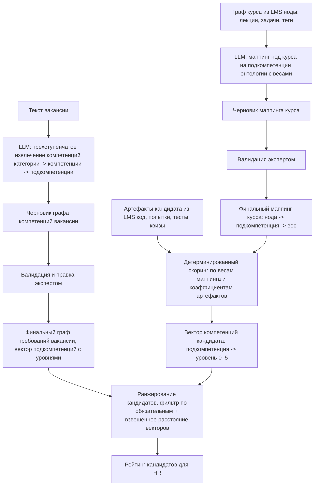

# ML System Design Doc: Система автоматизированного скоринга IT-компетенций (MVP)
## 1. Цели и предпосылки
### 1.1. Зачем идем в разработку продукта?

**Бизнес-цель:**
Сократить расходы на подбор персонала и время закрытия вакансий за счет исключения этапа ручного скрининга резюме и отсева нерелевантных кандидатов.

**Целевой эффект:**
Переход от оценки текста резюме к оценке реальных навыков, снижение риска ошибок в найме и стоимости проведения интервью экспертами.

**Почему станет лучше, чем сейчас, от использования ML:**  

**Текущее состояние:**  

Технические требования к вакансиям формулируются HR нечетко, что приводит к размытым и несопоставимым описаниям навыков. Кандидаты не получают четкого сигнала о том, что именно требуется, а нанимающая сторона не может объективно сравнить кандидатов между собой. Технический эксперт тратит время на интервью, часть из которых завершается досрочно из-за несоответствия кандидата базовым hard-skills требованиям.  

**С использованием ML:**

1. Вместо полного ручного составления списка компетенций экспертом - автоматическая декомпозиция вакансии на атомарные навыки, которая занимает менее минуты, плюс последующая валидация экспертом.
2. Ранжирование кандидатов происходит автоматически на основе объективных данных из LMS.
3. HR отбирает топ-N кандидатов с наиболее высоким скором соответствия навыков, что сокращает долю проведенных зря интервью.

**Что будем считать успехом итерации (бизнес-метрики):**

1. Доля кандидатов из топ-N рейтинга системы для конкретной вакансии, успешно прошедших первое техническое интервью, составляет не менее 70%.
2. Эксперт при валидации графа компетенций вносит не более 10-15% правок от общего числа извлеченных компетенций –  то есть вариант графа, составленный LLM, пригоден к использованию без существенных изменений.
3. Подготовка профиля вакансии с правками эксперта занимает не более 15 минут, что существенно меньше времени по сравнению с полностью ручным составлением.
4. Сопоставление нод курса (лекции/задания) с компетенции: доля нод, получивших корректный маппинг по оценке эксперта, составляет не менее 80%.
5. Корреляция скора системы с результатами технического интервью положительная и значимая (проверяется по итогам пилота).

### 1.2. Бизнес-требования и ограничения
**Бизнес-требования:**

- Система принимает на вход неструктурированный текст вакансии и выдает структурированный иерархический граф hard-skills: категория -> компетенция -> подкомпетенция.
- Интерфейс для эксперта: возможность отредактировать предложенный системой перечень компетенций, принять или отклонить предложения LLM о новых сущностях.
- Автоматический маппинг нод курса из LMS на компетенции из онтологии с весами; результат валидируется экспертом.
- Интеграция с внешней LMS: получение артефактов обучения и тестирования (код, результаты тестов, история попыток, граф курса и т.д.).
- Выдача HR-менеджеру финального рейтинга кандидатов с прозрачной системой оценивания на основе скора по компетенциям.

**Бизнес-ограничения:**

- В MVP система ориентирована на ограниченный набор ролей (Data Scientist / Backend) и не претендует на универсальное покрытие всех IT-профилей без дополнительной настройки онтологии.
- Фокус только на hard skills. Soft skills, локация и зарплатные ожидания в данной итерации не учитываются.
- Входом для оценки служат только проверяемые артефакты из LMS/контест-сервиса: код, результаты тестов, выполненные задания, история попыток и связанные метаданные.
- Конфиденциальность: персональные данные кандидатов в систему не передаются. Оперируем только анонимным ID и артефактами обучения из LMS (код, результаты тестов, попытки).

**Что мы ожидаем от конкретной итерации:**

Пилотный запуск на двух типах вакансий (Backend, Data Scientist). Результатом является отсортированный список кандидатов на каждую вакансию, переданный HR-менеджеру.

### 1.3. Что входит в скоуп проекта/итерации, что не входит
**Входит:**
- Модуль извлечения компетенций из текста вакансии.
- Интеграция с одной внешней LMS: получение графа курса, артефактов обучения и тестирования.
- Модуль маппинга нод курса LMS на компетенции из онтологии с весами (LLM + валидация экспертом).
- Интерфейс правки графа компетенций и маппинга экспертом, включая возможность принять или отклонить предложения LLM о новых компетенциях.
- Пайплайн оценки кандидата по артефактам LMS с использованием маппинга: формирование вектора компетенций и итогового скора.
- Двухступенчатая модель ранжирования:
  1. Фильтр по критичным (обязательным) компетенциям.
  2. Ранжирование по близости векторов компетенций кандидата и требований вакансии.

**Не входит:**
- Разработка собственной LMS (используем внешнюю систему).
- Интеграция с другими LMS, кроме одной пилотной.
- Оценка soft skills.
- Автоматическое обновление справочника компетенций в БД - только ручное добавление экспертом через интерфейс.
- Работа с резюме.

**Технический долг:**
- LLM и промпты подбираются в процессе путем сравнения результатов на пилотном наборе вакансий и курсов.
- В MVP используем внешнего LLM-провайдера; в перспективе - self-hosted провайдер.
- Оптимизация промптов и батчевая обработка для ускорения пайплайна.
- Веса и коэффициенты для скоринга артефактов (число попыток, качество кода, время и т.д.) подбираются вручную на этапе пилота.

### 1.4. Предпосылки решения
- Приоритет у объективных данных из LMS: код, результаты тестов, выполненные задания, число попыток и другие артефакты. Резюме не используются как шумный и недостоверный источник оценки hard skills.
- LLM используется только для подготовки черновиков (граф компетенций из вакансии, маппинг нод курса). Финальная версия всегда подтверждается экспертом.
- Фиксированная онтология компетенций в БД: категории, компетенции, подкомпетенции. Извлеченные навыки сопоставляются с ней, новые сущности добавляются только после согласования с экспертом.
- Гранулярность модели вакансии - иерархический граф: категория -> компетенция -> подкомпетенция. Уровень владения компетенцией (0–5) определяется набором освоенных подкомпетенций и их весами.
- Ранжирование кандидатов обновляется при поступлении новых данных из LMS или изменении профиля вакансии.
- В MVP система работает только с hard skills и только для ролей Backend / Data Scientist.

## 2. Методология (DS)

### 2.1. Постановка задачи

Система решает три ML-подзадачи, объединенные в единый пайплайн. Скоринг кандидата по артефактам LMS является детерминированным модулем с вручную подобранными весами и в рамках данного раздела не рассматривается как ML-задача.

**Подзадача 1 - Извлечение компетенций из текста вакансии**

Вход: неструктурированный текст вакансии.
Выход: иерархический граф компетенций (категория -> компетенция -> подкомпетенция), сопоставленный с онтологией из БД; опционально - предложения новых сущностей.
Техника: трехступенчатый LLM-пайплайн с промптингом и JSON-выводом. На каждом шагу модель получает текст вакансии и список сущностей текущего уровня из БД, выбирает релевантные и при необходимости предлагает новые.

**Подзадача 2 - Маппинг нод курса на онтологию компетенций**

Вход: граф курса из LMS (ноды с названиями, типами, тегами, текстом лекций, описаниями задач).
Выход: для каждой ноды - список подкомпетенций из онтологии с весом присутствия (0–1), отражающим степень раскрытия подкомпетенции в данной ноде, и типом покрытия (teaches/practices/evaluates).

Техника: трехэтапный пайплайн:
1. LLM-суммаризация контента ноды (лекция/задача) в краткое
   описание с сохранением ключевых тем и навыков.
2. Извлечение кандидатов-подкомпетенций из суммари
   (отдельный модуль - поиск по онтологии в БД).
3. LLM-валидация и определение весов: для каждой пары
   (нода, кандидат-подкомпетенция) модель определяет
   релевантность, вес связи и тип покрытия.

Результат валидируется экспертом; после валидации маппинг
фиксируется и используется для скоринга.

**Подзадача 3 - Ранжирование кандидатов под вакансию**

Вход: вектор компетенций кандидата (подкомпетенция -> уровень владения 0–5, получен из модуля оценки), вектор требований вакансии (подкомпетенция -> требуемый уровень, получен из подзадачи 1).
Выход: отсортированный список кандидатов с итоговым скором соответствия.
Техника: двухступенчатая схема - (1) жесткий фильтр по обязательным компетенциям, (2) скалярное взвешенное расстояние между векторами кандидата и вакансии. В перспективе - обучаемая модель ранжирования при наличии разметки (результатов интервью).

### 2.2. Блок-схема решения

Ниже представлена единая схема пайплайна от текста вакансии до рейтинга кандидатов. Бейзлайн и MVP различаются только внутри отдельных блоков (описано в 2.3); общая архитектура одинакова.

### 2.3. Этапы решения задачи

#### Этап 1 - Подготовка данных

Реальные данные из LMS доступны ограниченно на этапе MVP. Для разработки и валидации используется комбинация: синтетически сгенерированные примеры и небольшая выборка реальных данных из LMS (при наличии доступа).

| Название данных                                                | Наличие                                                     | Ресурс для получения | Качество проверено             |
| -------------------------------------------------------------- | ----------------------------------------------------------- | -------------------- | ------------------------------ |
| Тексты вакансий (Backend, DS)                                  | Синтетика + открытые источники (hh.ru)                      | DS                   | Нет, формируется на этапе 1    |
| Онтология компетенций (категории, компетенции, подкомпетенции) | Создается вручную экспертом в рамках проекта                | Эксперт + DS         | Нет, валидируется экспертом    |
| Граф курса из LMS (ноды, ребра, лекции, задачи)                | Частично доступен из LMS-партнера; синтетика как дополнение | DS + LMS-интеграция  | Нет, проверяется при получении |
| Артефакты прохождения курса кандидатами (код, попытки, тесты)  | Частично доступен из LMS; синтетика для покрытия edge cases | DS + LMS-интеграция  | Нет, проверяется при получении |
| Экспертная разметка маппингов (нода -> подкомпетенция)         | Создается в рамках проекта                                  | Эксперт              | Нет, является ground truth     |
| Экспертная разметка графов компетенций вакансий                | Создается в рамках проекта                                  | Эксперт              | Нет, является ground truth     |

**Выход этапа:**
- Онтология компетенций в БД (минимум: покрытие ролей Backend и Data Scientist).
- Размеченный набор из не менее 20 вакансий с валидированными графами компетенций (ground truth для подзадачи 1).
- Размеченный набор из не менее 2-3 курсов с валидированными маппингами нод (ground truth для подзадачи 2).
- Синтетические профили кандидатов для проверки ранжирования.

#### Этап 2 - Бейзлайн

**Бейзлайн для подзадачи 1 (извлечение компетенций):**
Одношаговый промпт без опоры на онтологию из БД - LLM извлекает компетенции напрямую из текста вакансии в свободном формате. Результат сравнивается с экспертной разметкой.

**Бейзлайн для подзадачи 2 (маппинг нод курса):**
Маппинг только по тегам ноды курса: прямое текстовое совпадение тега с названием подкомпетенции или ее синонимом из онтологии. Вес присутствия бинарный (0 или 1).

**Бейзлайн для подзадачи 3 (ранжирование):**
Сортировка кандидатов по числу совпавших обязательных подкомпетенций без учета уровней владения и весов.

**Метрики бейзлайна:**

| Подзадача              | Метрика                                                            | Целевой порог бейзлайна       |
| ---------------------- | ------------------------------------------------------------------ | ----------------------------- |
| Извлечение компетенций | Согласование с экспертом: доля подкомпетенций, принятых без правок | Фиксируем как отправную точку |
| Маппинг нод            | Согласование с экспертом: доля нод с корректным маппингом          | Фиксируем как отправную точку |
| Ранжирование           | Spearman correlation с экспертной расстановкой на синтетике        | Фиксируем как отправную точку |

Цель бейзлайна - зафиксировать нижнюю границу качества, относительно которой оценивается улучшение MVP.

#### Этап 3 - MVP

**MVP подзадача 1 (извлечение компетенций):**
Трехступенчатый LLM-пайплайн с опорой на онтологию: на каждом шагу модель получает текст вакансии и список сущностей текущего уровня из БД, выбирает релевантные, оценивает обязательность и при необходимости предлагает новые сущности с обоснованием. Промпт версионируется. Формат ответа - строгий JSON, валидируется по схеме.

Выборка для оценки: размеченный набор вакансий из этапа 1. Схема валидации: LLM-черновик сравнивается с экспертной разметкой до и после правки экспертом.

**MVP подзадача 2 (маппинг нод курса):**
Трехэтапный пайплайн:
1. LLM-суммаризация контента ноды (лекция/задача) в краткое описание с сохранением ключевых тем и навыков.
2. Извлечение вероятных подкомпетенций из онтологии (отдельный модуль - поиск релевантных подкомпетенций по суммаризированному контенту).
3. LLM-валидация и определение весов: для каждой пары (нода, вероятная подкомпетенция) модель оценивает релевантность, присваивает вес (0.0–1.0) и тип покрытия (teaches/practices/evaluates), фильтруя ложных кандидатов.

Результат валидируется экспертом и фиксируется в БД.

**MVP подзадача 3 (ранжирование):**
Двухступенчатая схема:
1. Жесткий фильтр: кандидаты, не покрывающие обязательные подкомпетенции вакансии выше порогового уровня, исключаются из рейтинга.
2. Взвешенное косинусное расстояние между вектором кандидата и вектором требований вакансии. Веса подкомпетенций определяются их важностью в графе вакансии (must have получают больший вес).

**Метрики MVP:**

| Подзадача              | Метрика                                                     | Целевой порог MVP      |
| ---------------------- | ----------------------------------------------------------- | ---------------------- |
| Извлечение компетенций | Доля подкомпетенций, принятых экспертом без правок          | ≥ 70%                  |
| Маппинг нод            | Доля нод с корректным маппингом по оценке эксперта          | ≥ 80%                  |
| Ранжирование (офлайн)  | Spearman correlation с экспертной расстановкой на синтетике | Значимо выше бейзлайна |
| Ранжирование (пилот)   | Доля кандидатов из топ-N, прошедших техническое интервью    | ≥ 70%                  |

**Риски и план:**

| Риск                                                                         | Что делаем                                                                                                               |
| ---------------------------------------------------------------------------- | ------------------------------------------------------------------------------------------------------------------------ |
| LLM предлагает нерелевантные компетенции, перегружая эксперта правками       | Ограничиваем число предложенных сущностей за один запрос; настраиваем порог уверенности через few-shot примеры           |
| Ноды курса слабо описаны (короткие теги без текста) - маппинг ненадежен      | Запрашиваем из LMS полный текст лекций и описания задач; для пустых нод маппинг помечается как требующий ручной проверки |
| Онтология не покрывает реальные требования вакансий пилота                   | Предусмотрен механизм предложения новых сущностей LLM + быстрое добавление экспертом до начала пилота                    |
| Отсутствие реальных данных о результатах интервью для валидации ранжирования | На этапе MVP валидируем офлайн на синтетике; корреляцию с интервью проверяем только в пилоте                             |

**Бизнес-проверка результатов:**
По завершении этапа эксперт проводит приемку на пилотном наборе: 10 вакансий и 3–5 курсов. Фиксируется доля принятых без правок сущностей и субъективная оценка полноты покрытия требований вакансии.

## 3. Подготовка пилота
 
### 3.1. Способ оценки пилота
 
Пилот проводится на двух типах вакансий (Backend, Data Scientist) с техническими экспертами в роли валидаторов. Полноценный A/B тест на данном этапе невозможен: нет исторических данных о найме и достаточного потока кандидатов. Поэтому пилот строится как экспертная офлайн-оценка.
 
**Дизайн пилота состоит из двух частей:**
 
**Часть 1 - офлайн-оценка качества ML-модулей (до реального использования):**
- Эксперт валидирует графы компетенций, сформированные системой по 20 реальным вакансиям, и маппинги по 2–3 курсам из LMS.
- Фиксируется доля принятых без правок сущностей и время, затраченное экспертом на валидацию одной вакансии.
- Система ранжирует синтетических кандидатов с известными профилями компетенций; результат сравнивается с экспертной расстановкой (Spearman correlation).
 
**Часть 2 - проверка ранжирования (при наличии реальных кандидатов):**
- HR получает топ-N кандидатов по двум пилотным вакансиям без просмотра резюме.
- После проведения технических интервью фиксируется, сколько кандидатов из топ-N прошли первое интервью успешно.
- Результаты используются для оценки бизнес-метрики и калибровки весов модуля оценки.
 

 
### 3.2. Что считаем успешным пилотом
 
**Метрики качества ML-модулей:**
 
| Метрика                                                     | Способ измерения                               | Порог успеха                      |
| ----------------------------------------------------------- | ---------------------------------------------- | --------------------------------- |
| Доля подкомпетенций вакансии, принятых экспертом без правок | Экспертная валидация на 20 вакансиях           | ≥ 70%                             |
| Доля нод курса с корректным маппингом                       | Экспертная валидация на 2–3 курсах             | ≥ 80%                             |
| Время валидации одной вакансии экспертом                    | Хронометраж сессии валидации                   | ≤ 15 минут                        |
| Spearman correlation ранжирования с экспертной расстановкой | Синтетические кандидаты с известными профилями | Значимо выше бейзлайна (p < 0.05) |
 
**Бизнес-метрика:**
 
| Метрика                                                                 | Способ измерения                              | Порог успеха |
| ----------------------------------------------------------------------- | --------------------------------------------- | ------------ |
| Доля кандидатов из топ-N, успешно прошедших первое техническое интервью | Обратная связь от HR/технического интервьюера | ≥ 70%        |
 
Если метрики ML-модулей не достигнуты - пилот считается провальным и не переходит к следующей части. Если следующая часть недостижима в рамках итерации (нет реального потока кандидатов), она переносится на следующий этап; пилот считается частично успешным при выполнении офлайн-метрик.
 
 
### 3.3. Подготовка пилота
 
**Вычислительная сложность:**
 
Основная вычислительная нагрузка пилота - вызовы внешнего LLM-провайдера. Классическое ML-обучение в пайплайне отсутствует, инфраструктурных GPU-затрат нет.
 
 
**Подзадача 1 - извлечение компетенций из одной вакансии:**
 
Трехступенчатый пайплайн разворачивается в дерево запросов.  
Например: выбрано 4 категории, из каждой - 3 компетенции (12 итого), из каждой - 3 подкомпетенции (36 итого).
 
- Шаг 1 (категории): 1 запрос. Текст вакансии (~500 т.) + 15–20 категорий с описаниями (~400 т.) ≈ **900 токенов input**.
- Шаг 2 (компетенции): 4 запроса, по 1 на выбранную категорию. Текст вакансии + 20–30 компетенций (~750 т.) ≈ **1 250 токенов input** на запрос.
- Шаг 3 (подкомпетенции): 12 запросов, по 1 на выбранную компетенцию. Текст вакансии + 20–40 подкомпетенций (~800 т.) ≈ **1 300 токенов input** на запрос.
 
Итого на 1 вакансию: **17 запросов**, ~17 500 токенов input, ~1 500 токенов output.
На 10 вакансий пилота: **~170 запросов**, ~175 000 input + ~15 000 output токенов.
 
**Подзадача 2 - маппинг одного курса (~70 нод, из которых ~30 лекции):**
 
- Суммаризация лекций: 1 запрос на лекцию. Текст лекции (~1 500 т.) ≈ **1 500 токенов input**, ~200 output. Итого: 30 запросов, ~45 000 input + ~6 000 output токенов.
- Поиск кандидатов-подкомпетенций для каждой ноды: тот же трехступенчатый пайплайн (~17 запросов на ноду, ~17 500 токенов input). Итого на курс: 70 × 17 = **1 190 запросов**, ~1 225 000 input токенов.
- Финальная валидация и расстановка весов: 1 запрос на ноду. Суммари ноды + список кандидатов-подкомпетенций ≈ **800 токенов input**, ~150 output. Итого: 70 запросов, ~56 000 input + ~10 500 output токенов.
 
Итого на 1 курс: **~1 290 запросов**, ~1 326 000 input + ~17 000 output токенов.
На 4 курса пилота: **~5 160 запросов**, ~5.3M input + ~68 000 output токенов.
 
**Итоговая оценка затрат на пилот (модель gpt-oss-20b: $0.03/M input, $0.14/M output):**
 
|                           | Запросы    | Input токены | Output токены | Стоимость  |
| ------------------------- | ---------- | ------------ | ------------- | ---------- |
| Подзадача 1 (10 вакансий) | ~170       | ~175K        | ~15K          | ~$0.008    |
| Подзадача 2 (4 курса)     | ~5 160     | ~5.3M        | ~68K          | ~$0.17     |
| **Итого**                 | **~5 330** | **~5.5M**    | **~83K**      | **~$0.18** |
 
Денежные затраты незначительны. Основной операционный риск - rate limits провайдера при параллельной обработке нод. Батчевая обработка реализуется с очередью и retry-логикой; точное время обработки одного курса уточняется на бейзлайн-эксперименте по реальным логам токенов.
 
**Что фиксируем до запуска пилота:**
- Версии промптов для всех трех шагов подзадачи 1 и трех шагов подзадачи 2.
- Используемую модель LLM и провайдера (фиксируется для воспроизводимости).
- Онтологию компетенций в БД (версия, зафиксированная экспертом).
- Состав пилотного набора: список вакансий, список курсов, список синтетических кандидатов.
- Параметры модуля оценки: веса артефактов (попытки, тесты, код).
- Порог жесткого фильтра ранжирования по обязательным компетенциям.
 
**План запуска:**
1. Технический прогон на 2–3 вакансиях и 1 курсе - проверка корректности пайплайна, формата вывода, схем JSON.
2. Офлайн-оценка на полном пилотном наборе - экспертная валидация, замер метрик ML-модулей.
3. Анализ ошибок: разбор типовых FP/FN в маппингах и графах компетенций, корректировка промптов при необходимости.
4. HR часть (при наличии кандидатов): передача топ-N HR, сбор обратной связи по результатам интервью.
5. Финальный отчет: метрики по каждому модулю, вывод о готовности к расширению на большее число вакансий и курсов.
 